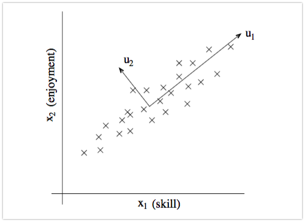

# 第五章 通过降维压缩数据

> 本章主要谈论**特征抽取**(**区别于特征选择**)，将涵盖如下主题：
>
> - 无监督数据压缩——**主成分分析**(Principal Component Analysis, PCA)
> - 基于类别可分最大化的监督降维技术——**线性判别分析**(Linear Discriminant Analysis)
> - 通过**核主成分分析**(kernel principal component analysis)进行非线性降维

## 无监督数据降维技术——主成分分析

特征抽取算法会将原始数据转换或者映射到一个新的特征空间。基于降维在数据预处理领域的含义，特征抽取可以理解为：在尽可能多的保持相关信息的情况下， 对数据进行压缩的一种方法。**特征抽取通常用于提高计算效率，同样也可以帮助我们降低"维度灾难"——尤其当模型不适于正则化处理时**。

主成分分析是一种广泛应用于不同领域的**无监督线性数据转换技术**，其突出作用是降维。常用领域包含：股票交易市场数据的探索性分析和信号去噪，生物信息学领域的基因组和基因表达水平数据分析等。PCA是基于特征之间的关系识别出数据内在的模式，简而言之，PCA的目标是在高维数据中找到**最大方差的方向**，并**将数据映射到一个维度不大于原始数据的新的子空间上**。

如上图所示，$x_1,x_2$为原始特征的坐标轴，而$u_2,u_1$为主成分，主成分的约束条件为以新特征的坐标是相互正交的，同理的，$u_1,u_2$为方差最大的方向。

使用PCA降维，需要构建一个$d×k$维的转换矩阵$W$，这样就可以将一个样本向量x映射到一个新的k维特征子空间上去，$d >> k$。

PCA中第一主成分的方差应该是最大的，由于各主成分之间是不相关的(正交的)，后续各主成分也具备尽可能大的方差。**注意:PCA的主成分方向是特征缩放敏感的**。

**PCA算法流程：**

1. 对原始d维数据集做**标准化**处理
2. 构造样本的**协方差矩阵**
3. 计算**协方差矩阵的特征值**和**相应的特征向量**
4. 选择与**前k个最大特征值**对应的特征向量，其中k为新特征空间的维度($k\leq d$)
5. 通过前k个特征向量**构建映射矩阵W**
6. 通过映射矩阵W将d维的输入数据集X转换到新的k维特征子空间

### 总体方差与贡献方差

通过构建协方差矩阵(两个特征之间的协方差计算公式为:$\sigma_{jk} = \frac{1}{n}\sum_{i=1}^{n}(x_j^i-\mu_j)(x_k^i-\mu_k)$)

进行协方差矩阵分析，求出特征值以及特征向量，通过公式计算$\frac{\lambda_j}{\sum_{j=1}^{d}\lambda_j}$方差贡献率，贡献率越大的特征值对应的特征向量对应越大的方差方向。

