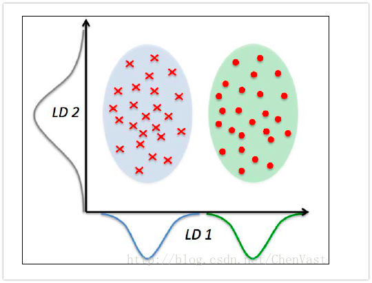

# 第五章 通过降维压缩数据

> 本章主要谈论**特征抽取**(**区别于特征选择**)，将涵盖如下主题：
>
> - 无监督数据压缩——**主成分分析**(Principal Component Analysis, PCA)
> - 基于类别可分最大化的监督降维技术——**线性判别分析**(Linear Discriminant Analysis)
> - 通过**核主成分分析**(kernel principal component analysis)进行非线性降维

## 无监督数据降维技术——主成分分析

特征抽取算法会将原始数据转换或者映射到一个新的特征空间。基于降维在数据预处理领域的含义，特征抽取可以理解为：在尽可能多的保持相关信息的情况下， 对数据进行压缩的一种方法。**特征抽取通常用于提高计算效率，同样也可以帮助我们降低"维度灾难"——尤其当模型不适于正则化处理时**。

主成分分析是一种广泛应用于不同领域的**无监督线性数据转换技术**，其突出作用是降维。常用领域包含：股票交易市场数据的探索性分析和信号去噪，生物信息学领域的基因组和基因表达水平数据分析等。PCA是基于特征之间的关系识别出数据内在的模式，简而言之，PCA的目标是在高维数据中找到**最大方差的方向**，并**将数据映射到一个维度不大于原始数据的新的子空间上**。

如上图所示，$x_1,x_2$为原始特征的坐标轴，而$u_2,u_1$为主成分，主成分的约束条件为以新特征的坐标是相互正交的，同理的，$u_1,u_2$为方差最大的方向。

使用PCA降维，需要构建一个$d×k$维的转换矩阵$W$，这样就可以将一个样本向量x映射到一个新的k维特征子空间上去，$d >> k$。

PCA中第一主成分的方差应该是最大的，由于各主成分之间是不相关的(正交的)，后续各主成分也具备尽可能大的方差。**注意:PCA的主成分方向是特征缩放敏感的**。

**PCA算法流程：**

1. 对原始d维数据集做**标准化**处理
2. 构造样本的**协方差矩阵**
3. 计算**协方差矩阵的特征值**和**相应的特征向量**
4. 选择与**前k个最大特征值**对应的特征向量，其中k为新特征空间的维度($k\leq d$)
5. 通过前k个特征向量**构建映射矩阵W**
6. 通过映射矩阵W将d维的输入数据集X转换到新的k维特征子空间

### 总体方差与贡献方差

通过构建协方差矩阵(两个特征之间的协方差计算公式为:$\sigma_{jk} = \frac{1}{n}\sum_{i=1}^{n}(x_j^i-\mu_j)(x_k^i-\mu_k)$)

进行协方差矩阵分析，求出特征值以及特征向量，通过公式计算$\frac{\lambda_j}{\sum_{j=1}^{d}\lambda_j}$方差贡献率，贡献率越大的特征值对应的特征向量对应越大的方差方向。

> 在图像识别任务中的某些情况下，如每个类别中只有少量样本，使用PCA作为预处理工具的分类效果更佳。

## 通过线性判别分析压缩无监督数据

线性判别分析(LDA)是一种可作为特征抽取的技术，它可以提高数据分析过程中的计算效率，同时，**对于不适用于正则化的模型，它可以降低因维数灾难带来的过拟合**。

LDA的基本概念与PCA非常相似，PCA试图在数据集中找到方差最大的正交的主成分分量的轴，而**LDA的目标是发现可以最优化分类的特征子空间**。LDA与PCA都是可用于降低数据集维度的线性转换技巧。其中，**PCA是无监督算法，而LDA是监督算法**。

**注意**：**线性判别分析算法是特征缩放敏感的**。

如上图所示，在x轴方向(LD1),通过线性判定，可以很好地将呈正态分布的两个类分开。虽然沿y轴方向的线性判别保持了数据集的较大方差，但是**沿此方向无法提供关于类别区分的任何信息，因此它不是一个好的线性判别**。

**LDA的假设前提条件：**

- 数据呈正态分布
- 各类别中数据具有相同的协方差矩阵
- 各类别样本的特征从统计上来讲是相互独立的

**LDA算法的关键步骤**：

1. 对d维数据集进行**标准化处理**
2. 对于每一类别，计算**d维的均值向量**
3. 构造**类间的散布矩阵**$S_B$以及**类内的散布矩阵**$S_W$
4. 计算**矩阵$S_W^{-1}S_B$的特征值**以及对应的**特征向量**
5. 选取前k个特征值所对应的特征向量，构造一个dxk为的**转换矩阵W**，其中特征向量以列的形式排列
6. 使用转换矩阵W将**样本映射**到新的特征子空间上

## 使用核主成分分析进行非线性映射

> 我们目前学习过的算法中，像adaline、逻辑斯蒂回归和支持向量机等，都无法实现完美线性划分的原因归咎于噪声。然而，在现实生活中，大多数情况下我们面对的问题都是非线性的，针对此问题，通过降维技术，如PCA、LDA等将其转换为线性问题的办法并不是最好的方法。本节将利用核技巧的PCA，或称核PCA，将学习如何将非线性可分的数据转换到一个合适对其进行线性分类的新的低维子空间上。

### 核函数与核技巧

根据前面的PCA算法中，计算两个特征k和j之间的协方差公式为：
$$
\sigma_{jk} = \frac{1}{n}\sum_{i=1}^{n}(x_j^i - \mu_j)(x_k^i - \mu_k)
$$
由于对特征进行了缩放，所以它们相应的均值为0，因此上式变成：
$$
\sigma_{jk} = \frac{1}{n}\sum_{i=1}^{n}(x_j^i )(x_k^i)
$$
那么，协方差矩阵公式可以写成：
$$
\Sigma = \frac{1}{n} \sum_{i=1}^{n} X^{(i)}X^{(i)T}
$$

根据核函数的概念，通过非线性函数$\phi$把原始数据映射到更高维的空间中，所以上式应用核函数映射后，变成:
$$
\Sigma = \frac{1}{n} \sum_{i=1}^{n} \phi(X^{(i)})\phi(X^{(i)})^T
$$
通过对协方差矩阵进行分析，求出它的特征向量以及特征值，公式为：
$$
\Sigma V = \lambda V \\
\Rightarrow \frac{1}{n} \sum_{i=1}^{n} \phi(X^{(i)})\phi(X^{(i)})^T V = \lambda V \\
\Rightarrow V = \frac{1}{n\lambda} \sum_{i=1}^{n} \phi(X^{(i)})\phi(X^{(i)})^T V = \frac{1}{n}\sum_{i=1}^{n}a^{(i)} \phi(X^{(i)})
$$
这里，$a$表示核矩阵K的特征向量。

核矩阵的推到过程如下：
$$
\Sigma = \frac{1}{n} \sum_{i=1}^{n} \phi(X^{(i)})\phi(X^{(i)})^T = \frac{1}{n}\phi(X)^T\phi(X)
$$
其中，$\phi(X)$表示n x k维的矩阵。

现在，我们将特征向量的公式记为：
$$
V = \frac{1}{n}\sum_{i=1}^{n}a^{(i)} \phi(X^{(i)}) = \lambda \phi(X)^T a
$$
由$\Sigma V = \lambda V$,可得：
$$
\frac{1}{n}\phi(X)^T\phi(X)\phi(X)^T a =  \lambda \phi(X)^T a
$$
两边同时乘以$\phi(X)$，可得：
$$
\frac{1}{n}\phi(X)\phi(X)^T\phi(X)\phi(X)^T a =  \lambda \phi(X)\phi(X)^T a \\
\Rightarrow \frac{1}{n}\phi(X)\phi(X)^T a =  \lambda  a \\
\Rightarrow \frac{1}{n}K a = \lambda a
$$
其中，第一步推出第二步的原因是$\phi(X)\phi(X)^T$为对称矩阵，可逆矩阵，所以可以通过等式左右乘以它的逆，从而推出第二步，K为相似核矩阵:
$$
K = \phi(X)\phi(X)^T
$$
核函数也可理解为：通过两个向量点积来度量向量间相似度的函数。最常用的核函数有：

多项式核：
$$
\mathcal{K}(x^i,x^j) = (x^{(i)T}x^j+\theta)^p
$$
其中，阈值$\theta$和幂的值p需自行定义。

双曲正切核(sigmoid):
$$
\mathcal{K}(x^i,x^j) = \mathrm{thah}(\eta x^{(i)T}x^j+\theta)
$$
径向基核函数(RBF),或者高斯核函数:
$$
\mathcal{K}(x^i,x^j) = \exp\left( - \frac{\|x^i-x^j\|^2}{2\sigma^2}\right)
$$
也可以写作：
$$
\mathcal{K}(x^i,x^j) = \exp\left( - \gamma\|x^i-x^j\|^2\right)
$$
综合上述讨论，我们可以通过如下三个步骤来实现一个基于RBF核的PCA：

1. 计算核矩阵(相似矩阵)K：
   $$
   \mathcal{K}(x^i,x^j) = \exp\left( - \gamma\|x^i-x^j\|^2\right)
   $$

如果我们需要计算任意两个样本之间的值，同时该样本集含有100个样本，那么我们需要计算100x100次上面的公式。

2. 通过如下公式进行计算，使核矩阵K更为聚集：
   $$
   K^{'} = K-l_nK-Kl_n+l_nKl_n
   $$
   其中，$l_n$是一个nxn维的矩阵，其所有的值均为$\frac{1}{n}$. 这一步的目的在于使假设(**进行核映射之后的所有特征均值为0，即确保新特征空间的中心在零点**)成立。

3. 将聚集后的核矩阵的特征值按照降序排列，选择前k个特征值所对应的特征向量。与标准PCA不同，这里的特征向量不是主成分轴，而是将样本映射到这些轴上。

**注意**：核矩阵公式中存在一个超参数gamma，我们可以通过网格搜索来获取最优的超参数。

### 映射新的数据集

回忆一下核PCA的原理可以记得，我们从聚集核矩阵中得到了特征向量($a$)，这意味着样本已经映射到了主成分轴V。由此，将新样本$x^{''}$映射到此主成分轴上，只需要应用如下公式：
$$
\phi(x^{'})^TV
$$
值得注意的是，核PCA是一种基于内存的方法，这意味着每次映射新的数据集前，都需要使用原始训练数据。我们需要计算训练数据集中每一个样本与新样本之间的RBF核(相似度)：
$$
\phi(x^{'})^TV = \sum_{i}a^i\phi(x^{'})^T\phi(x^i) = \sum_{i} a^i K(x^{'},x^i)^T
$$
在完成新样本和训练数据集内样本间的相似度计算后，还需要通过特征向量对应的特征值来对其进行归一化处理。

## 延伸阅读

sklearn中实现了很多高级的非线性降维技术，可以通过此[链接](http://scikit-learn.org/stable/modules/manifold.html)http://scikit-learn.org/stable/modules/manifold.html访问。

## 小结

本章通过三种不同的基于特征抽取的基本降维技术：标准PCA、LDA以及核PCA。使用PCA，我们可以在忽略类标的情况下，将数据映射到一个低维的子空间上，并沿正交的特征坐标方向使反差最大化。与PCA不同，LDA是一种监督降维技术，这意味这：在线性特征空间中尝试使得类别最大可分时，需要使用训练数据集中的类别信息。最后，我们学习了核PCA，通过核PCA可以将非线性数据集映射到一个低维的特征空间中，使得数据线性可分。