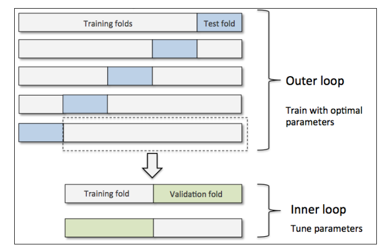
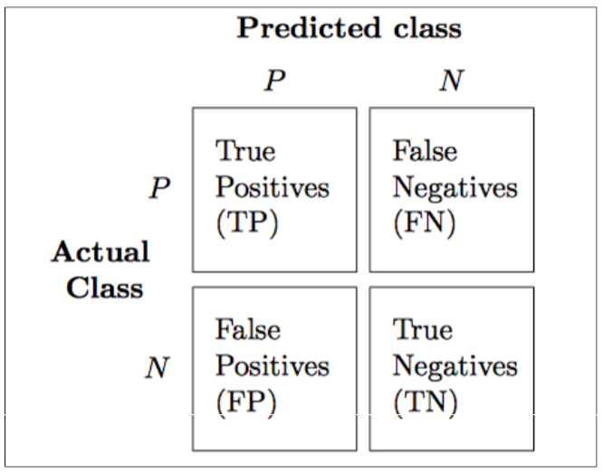

# 模型评估与参数调优实战

本章内容包括：

- 模型性能的无偏估计
- 处理机器学习算法中常见问题
- 机器学习模型调优
- 使用不同的性能指标评估预测模型

## 基于流水线的工作流

在前面的章节中，我们使用训练数据对模型进行拟合的时候的得到了一些参数，但将模型用于新数据时需重设这些参数。本节读者将学到一个方便使用的工具：sklearn中的pipline类。它可以把训练数据集拟合得到的一些参数，应用于新数据的预测。

## 评估模型性能

构建机器学习模型的一个关键步骤就是**在新数据上对模型的性能进行评估**。本节我们将使用两种有用的交叉验证技术：holdout交叉验证(holdout cross-validation)和k折交叉验证(k-fold cross-validation),借助于这两种方法，我可以得到模型泛化误差的可靠估计，即模型在新数据上的性能表现。

### holdout方法

>  **模型选择**指的是针对给定分类问题我们调整参数以寻求最优值(也称为超参)的过程。

holdout方法分四步：

1. 将数据集分成三部分：训练集、验证集、测试集
2. 使用不同的参数和训练集对模型进行训练
3. 使用验证集评估训练好的模型性能
4. 挑选出前面验证得出的最好的模型和测试集对模型的泛化误差做出评估

步骤2,3是通过改变模型超参数反复执行的步骤，直到找出最优的模型(也就是**模型选择的过程**)。

holdout方法的缺点在于：模型性能的评估对训练数据集划分为训练及验证子集的方法是敏感的，因为评价的结果会随样本的不同而发生变化。

### K折交叉验证

在k折交叉验证中，我们不重复地随机将训练数据集划分为k个，其中k-1个用于模型的训练，剩余的1个用于测试。重复此过程k次，我们就得到了k个模型及对模型性能的评价。整体模型的性能估计是k个模型的性能估计的平均值。对比于holdout，k折交叉验证通过不重复的随机将训练数据集划分为k个来降低holdout方法对数据集的敏感。两种方法的区别在于数据集的划分上。

两者的对比：

- k折交叉验证使用无放回抽样，而holdout则是重复使用同一个训练样本以及验证样本。优点在于无放回抽样使得模型性能的评估具有较小的方差

经验值：

- 通常情况下，k=10
- 小数据集，k大于10
- 较大数据集，k=5

k值的选择准则在于:小数据集使用较大的k值，可以使得更多的数据同于训练，可以得到较小的偏差。但是k值越大，计算复杂度也会相应的增大，同时也会导致较高的方差。较大数据集，由于有足够的训练数据来支撑更加复杂的模型，那么就会得到较小的偏差，同时为了防止计算量过大以及过拟合问题，k值不宜过大，因此针对大数据集k值选了比较小的值。

#### 留一交叉验证法(leave-one-out,LOO)

将训练集划分的数量等同于样本数(k=n),这样每次只有一个样本用于测试。**当数据集非常小时，建议使用此方法进行验证**。

#### 分层k折交叉验证

分层k折交叉验证区别于标准k折交叉验证在于类别比例在每个分块中的以保持，这使得每个分块中的类别比例与训练数据集的整体比例一致。

#### 小结

交叉验证中泛化性能方差的估计，参考论文:[analysis of variance of cross-validation estimators of the generalization error](http://www.jmlr.org/papers/volume6/markatou05a/markatou05a.pdf)

## 通过学习及验证曲线来调试算法

在本节，将学习两个有助于提高算法性能的简单但功能强大的判定工具:学习曲线(learning curve)、验证曲线(validation curve)。

### 使用学习曲线判定偏差和方差问题

如果模型在给定训练数据集熵过于复杂(模型中存在太多的自由度或者参数)，那么这个模型很可能出现过拟合。**通常情况下，收集更多的训练样本有助于降低模型的过拟合程度**。

通过将模型的训练及准确性验证看作是训练数据集大小的函数，并绘制其图像，**很容易看出模型是面临高偏差还是高方差问题**：

左上图显示的是一个高偏差模型。此模型的训练准确率和交叉验证准确率都很低。解决此问题的常用方法，通常是增加模型中参数的数量。例如，收集或构建新特征，或者降低类似于svm、logistic regression等模型的正则化程度。

右上图显示的是一个高方差模型。表明训练准确度与交叉验证准确率之间有很大的差距。解决此问题的常用方法，收集更多的训练数据或者降低模型的复杂度(正则化，降维，特征选择)

### 通过验证曲线来判定过拟合与欠拟合

**验证曲线**绘制的是准确率与模型参数之间的关系。

## 通过网格搜索调优机器学习模型

机器学习中，有两类参数：一种是通过模型学习求出来的参数，另外一种就是需要手动设置的超参数。

### 使用网格搜索调优超参

网格搜索法(**结合了k折交叉验证**)通过对指定的不同超参列表进行暴力枚举搜索，并评估每个超参组合对模型性能的影响，以获得参数的最优组合。**可以把它看作验证曲线的推广**。

**优点：**

- 总能找到最优的参数组合

**缺点：**

- 计算成本昂贵

> 还有一种抽取不同参数组合的方法就是[“随机搜索](http://scikit-learn.org/stable/modules/generated/sklearn.model_selection.RandomizedSearchCV.html#sklearn.model_selection.RandomizedSearchCV)”，它可以以特征的代价从抽样分布中抽取出随机的参数组合。

### 通过嵌套交叉验证选择算法

前面我们都是通过在同一种模型中，对其调参来获取最优的模型参数。如果要在**不同机器学习算法**中做出选择，则推荐另外一种方法——嵌套交叉验证。

> 使用嵌套交叉验证，估计的真实误差与在测试集上得到的结果几乎没有差距。参考论文：《[bias in error estimation when using cross-validation for model selection](https://bmcbioinformatics.biomedcentral.com/articles/10.1186/1471-2105-7-91)》

1. 在嵌套交叉验证的外围循环中，我们将数据划分为训练块和测试块，对模型选取不同的超参数组合
2. 在模型选择的内部循环中，基于训练块使用k折交叉验证评估模型，然后进行模型选择
3. 退出内部循环之后，使用测试块评估模型

## 了解不同的性能评价指标

模型评估指标：

- 准确率(accuracy)
- 精确率(precision)
- 召回率(recall)
- F1分数(F1-score)

### 读取混淆矩阵

### 优化分类模型的准确率和召回率

预测误差(ERR)和准确率(ACC)都提供了误分类样本数量的相关信息。
$$
ERR = \frac{FP+FN}{FP+FN+TP+TN} \\
ACC = \frac{TP+TN}{FP+FN+TP+TN} = 1-ERR
$$
**对于类别数量不均衡的分类问题来说**，真正率(TPR)和假正率(FPR)是非常有用的性能指标:
$$
FPR  =\frac{FP}{N} = \frac{FP}{FP+TN} \\
TPR = \frac{TP}{p} = \frac{TP}{FN+TP}
$$

> 以肿瘤诊断为例，我们更为关注的是正确检测出恶性肿瘤，使得病人得到恰当治疗，而相比之下降低良性肿瘤的误判率(假正率)对患者的影响不大。真正率提供了关于正确识别出恶性肿瘤样本的有用信息。

精确率(precision,PRE)和召回率(recall,REC)是与真正率、真负率相关的性能评价指标，实际上，召回率与真正率含义相同：
$$
PRE = \frac{TP}{TP+FP} \\
REC = TPR = \frac{TP}{P}=\frac{TP}{FN+TP}
$$
在实践中，常采用**精确率与召回率的组合**，称为**F1分数**：
$$
F1 = 2\frac{PRE× REC}{PRE+REC}
$$

### 绘制ROC曲线

受试者工作特征曲线(receiver operator characteristic , ROC)是基于模型假正率和真正率等性能指标进行分类模型选择的有用工具，假正率和真正率可以通过移动分类器的分类阈值来计算。

ROC曲线的对角线理解为随机猜测，如果分类器性能曲线在对角线以下，那么其性能就比随机猜测还差。

> 对于完美的分类器来说，其真正率为1，假正率为0，这时的ROC曲线即为横轴0与纵轴1组成的折线。

**基于ROC曲线**，我们可以计算ROC曲线下的区域(area under the curve,**AUC**),用来**刻画分类模型的性能**。

**延伸**:不同概率阈值下分类器的[精确率-召回率曲线](http://scikit-learn.org/stable/modules/generated/sklearn.metrics.precision_recall_curve.html)

