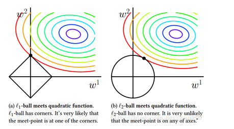

# 数据预处理-构建好的训练数据集

机器学习算法最终学习结果的优劣**取决于两个主要因素：**

- 数据的质量
- 数据中蕴含的有用信息的数量

本章将涵盖如下主题：

- 数据集中缺失数据的删除和填充
- 数据格式化
- 模型构建中的特征选择

## 缺失数据的处理

- 直接删除包含缺失数据的行或列
  - 缺点：可能会删除过多的样本，导致分析结果可靠性不高。从另一方面讲，删除过多的特征例，有可能会面临丢失有价值信息的风险，而这些信息是分类器用来区分类别所必需的。
- 缺失数据填充(插值技术)(from sklearn.preprocessing import Imputer)
  - 最常用的插值技术之一就是均值插补，即使用相应的特征均值来替换缺失值
  - 众数插值
  - 中位数插值

##处理类别数据

在真实数据集中，经常会出现一个或多个类别数据的特征列。类别数据有两种:

- 标称特征(nominal feature)。不具备排序的特性。比如，衣服的颜色(red,blue,green)
- 有序特征(ordinal feature)。有序特征理解为类别的值是有序的或可以排序的。比如，衣服的尺寸(XL>L>M)。

所以，我们需要对上面的不同的类别数据使用不同的编码方式，使得它们变成可以被计算机处理的数值数据。

### 有序特征的映射

为了确保学习算法可以正确的使用有序特征，我们需要将类别字符串转成整数。使用sklearn中的LabelEncoder来实现。

### 标签编码

把字符串类型的标签转成一一对应的整型，便于机器学习算法的处理。使用sklearn中的LabelEncoder来实现。

###标称特征上的独热编码

标称数据类似于衣服颜色，没有特征的顺序，如果使用前面的编码方式会使得相应的特征带有顺序信息，会给机器学习算法额外的信息使得算法最终学习到的模型出现很大的误差。

解决此问题最常用的方法就是**独热编码(one-hot encoding)技术**。这种方法的理念就是创建一个新的**虚拟特征(dummy feature)**。虚拟特征的每一列各代表标称数据的一个值。可通过pandas的**get_dummies**方法来实现。

以衣服颜色为例，数据集中衣服颜色一共有三种取值(red,green,blue)，那么使用独热编码技术，将颜色特征转换为3个新的特征:blue、green、red。此时可以使用二进制值来表示样本的颜色。例如，蓝色样本表示为blue=1,red=0,green=0。

## 数据集划分

把数据集划分成训练集和测试集是为了使用训练集来创建模型之后，通过测试集来评估模型的泛化能力。对于数据集划分的比例通常是6:4、7:3或8:2。对于非常庞大的数据集，将训练集和测试集的比例按照9:1或者99:1进行划分也是可以的。可以通过sklearn的train_test_split函数进行划分。

## 特征值缩放

决策树和随机森林是机器学习算法中为数不多的不需要进行特征缩放的算法。然而，对于大多数机器学习和优化算法而言，将特征的值缩放到相同的区间可以使其性能更佳。比如，使用平方误差作为代价函数的算法，通常会着重优化级数更大的特征相应的参数。特征缩放有两个常用方法:

- 归一化

  归一化指的是将特征的值缩放到区间[0,1]，它是最小-最大缩放的一个特例。
  $$
  x_{norm}^i = \frac{x^i-x_{min}}{x_{max}-x_{min}}
  $$
  对应于sklearn中的MinMaxScaler函数

- 标准化

  对于大部分机器学习算法，标准化的方法却更加实用。这是因为：许多现行模型在训练的最初阶段，即权重初始化阶段，可将其值设定为0或是趋近于0的随机极小值。通过标准化，我们可将特征列的均值设为0，方差为1，使得特征例的值呈标准正态分布，这更易于权重的更新。(为什么呢?)标准化方法保持了异常值所蕴含的有用信息，并且使得算法受到这些值的影响较小。

  标准化的过程可用如下方程表示:
  $$
  x_{std}^i = \frac{x^i-\mu_x}{\sigma_x}
  $$
  其中，$\mu_x$和$\sigma_x$分别为样本某个特征例的均值和标准差。

## 特征选择

### 过拟合

过拟合是指模型参数对于训练数据集的拟合的非常好，但训练数据集的分布与真实数据并不一致，使模型在测试集上拟合效果很差，泛化能力差，泛化误差大。过拟合的原因在于模型过于复杂。常用的降低泛化误差的方案有:

1. 收集更多的训练数据
2. 通过正则化引入惩罚项
3. 选择一个参数相对较少的简单模型
4. 降低数据的维度(特征选择,特征工程)

一般来说，收集更多的训练数据不太适用。

#### 使用L1正则化满足数据稀疏化

$$
L1: \|W\|_1 = \sum_{j=1}^{m}|w_j|
$$

L1正则化可生成稀疏的特征向量，且大多数的权值为0,。当高维数据集中包含许多不相关的特征，尤其是不相关的特征数量大于样本数量时，权重的稀疏化处理能够发挥很大的作用。从这个角度来看，**L1正则化可以视为一种特征选择技术。**

如上图所示，左图表示使用L1正则化，右图表示使用L2正则化。

先来看L2正则化，圆形表示正则项的图，等高线图表示代价函数，两图的重合区域为权重的可行域。可行域中越靠近等高线中心的点，代价函数与正则化项之和最小，那么该点就是两图的切线处。我们最终的目的是使得代价函数与正则化项之和最小。

同理的L1正则化，菱形在坐标上的黑点与等高线的焦点处，代价函数与正则化项之和最小。

**结论:**L1正则化可以剔除不相关特征，使得模型对不相关特征鲁棒。

#### 序列特征选择算法

> 另外一种将模型复杂度从而解决过拟合问题的方法是通过特征选择进行降维。该方法对未经过正则化处理的模型特别有效。**降维技术**主要分为两个大类:**特征选择**和**特征提取**。
>
> - 特征选择
>
>   通过特征选择，选出原始特征的一个子集
>
> - 特征提取
>
>   通过对现有的特征信息进行推演，构造出一个新的特征子空间。
>
> 特征选择算法的目的：剔除不相关特征或噪声，自动选出与问题最相关的特征子集，从而提高计算效率或是降低模型的泛化误差。这在模型不支持正则化时尤为有效(决策树和KNN算法不支持正则化)。

序列特征选择算法是一种贪婪搜索算法，用于将原始的d维特征空间压缩到一个k维特征子空间，其中k<d。经典的序列特征选择算法是**序列后向选择算法(Sequential Backward Selection,SBS)**，**其目的在于分类性能衰减最小的约束下，降低原始特征空间上的数据维度，以提高计算效率。**

> 延伸:穷举搜索算法

SBS算法的核心:SBS依次从特征集合中删除某些特征，直到新的特征子集空间包含指定数量的特征。为了确定每一步所需删除的特征，我们定义一个需要最小化的代价函数。该函数的作用是比较判定分类器的性能在删除某个特定特征前后的差异。选择剔除那些使得代价函数值尽可能大的特征。

### 特征选择算法延伸

sklearn中提供很多特征选择算法，基于特征权重的递归后向消除算法(recursive backward elimination based on feature weights)、基于特征重要性的特征选择树方法(tree-based methods to select features by importance)，以及单变量统计测试(univariate statistical tests)。更多[参考](http://scikit-learn.org/stable/modules/feature_selection.html)

### 通过随机森林判定特征的重要性

随机森林应对非线性可分数据的时候，使用了所有决策树的平均不纯度衰减来度量特征的重要性。

